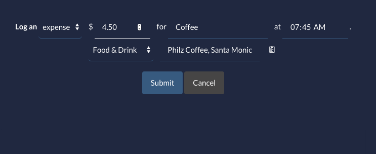
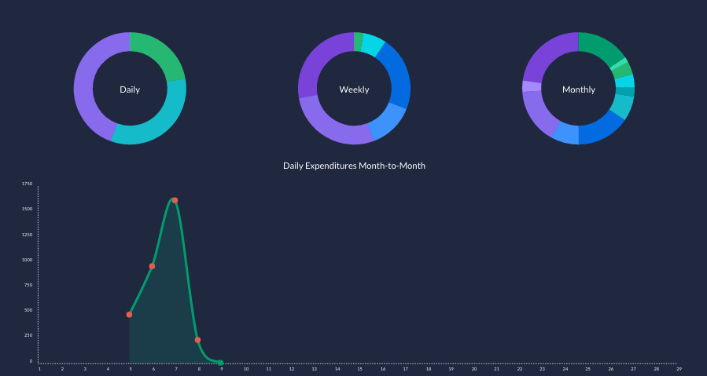
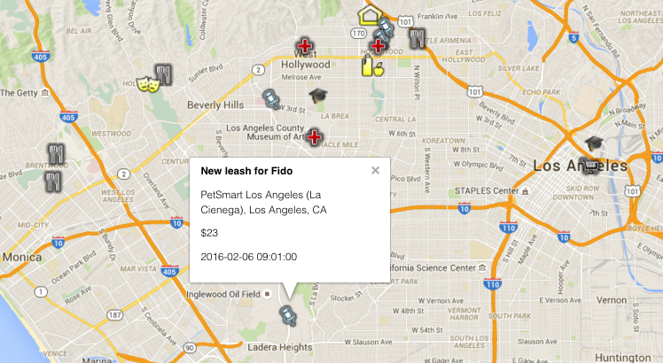
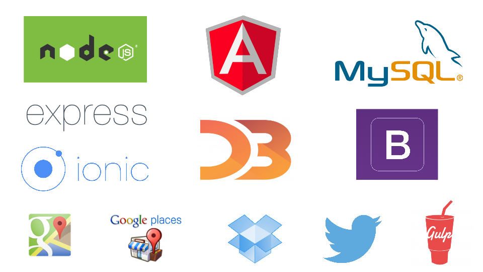

#Budgie

Studies show that barely a third of all Americans keep a detailed budget, and it's not hard to see why -- keeping track of one's spending habits is often tedious and time-consuming.

But it doesn't have to be.

[Budgie](http://budgie-alpha.herokuapp.com) is a new money management app that combines a sleek, intuitive interface with a rich set of visual tools to make taking charge of your finances both easy and -- dare we say it -- fun. 

Visit [budgie-alpha.herokuapp.com](http://budgie-alpha.herokuapp.com) to get started. 

##Key Features

__Budgie's dashboard interface makes logging transactions quick and painless:__

__Budgie's colorful graphs provide a detailed glimpse of your cash-flow trends:__

__Budgie's transaction map allows you to see precisely where your money is going:__

... more features/screengrabs tbd

#Architecture

tbd

#Tech Stack

#The Budgie Team:

- [__VJ Aguilar__](https://github.com/shinyness)
- [__Thomas Leupp__](https://github.com/Cygnus2112)
- [__Joseph Martin__](https://github.com/jpranaymartin)
- [__Kaushik Sahoo__](https://github.com/kaushiksahoo2000)

#Contributing

If you are interested in contributing to this project, check out our [CONTRIBUTING.md](CONTRIBUTING.md) for general guidelines.